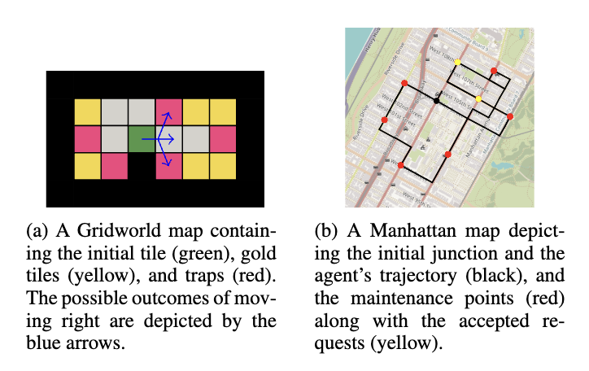

[](http://www.repostatus.org/#active)
[](https://ci.appveyor.com/project/bsamseth/cpp-project/branch/master)
[](https://github.com/bsamseth/cpp-project/blob/master/LICENSE)


# Risk-Aware Tree Search
This repository contains code base for development and testing of risk-aware tree search based methods.


## Algorithms
- TUCT: Threshold tree search. Implements the Pareto curve-based algorithm T-UCT (ours).
- CCPOMCP: Dual tree search. Implements the dual algorithm CC-POMCP.
- RAMCP: Risk-aware POMCP. Implements the LP-based algorithm RAMCP.

## Tasks
- Gridworld: A reachability tasks on a 2D grid. The agent movement is subject to noise that causes the agent to "slip" in a random direction with certain probability.
  - Avoid: Collect as many gold coins (+1 reward) as possible while avoiding traps. With probability $p$, the environment terminates on entering a trap tile (+1 cost).
  - SoftAvoid: Collect as many gold coins as possible (+1 reward) while avoiding traps (+$p$ cost). The environment does not terminate on entering the trap tile.
- Manhattan: An AEV navigation task on a probabilistic model of mid-town Manhattan traffic.
  - A selected set of points on the map periodically request AEV to perform a maintenance task. If the AEV accepts the request, it receives a reward of +1 upon reaching the maintenance point. If it reaches the maintenance point too late or never, it moreover receives a cost of -1.

<p align="center">

</p>

## Build
The canonical way to build the project is throuh Docker. You can build the Docker image by running the following command:
```sh
docker build -t rats .
```

## Run experiments
To run the experiments, you can then use the following command:
```sh
docker run --rm -v $(pwd)/outputs:/work/rats/outputs -it rats python3 scripts/eval_small_gw.py
```
The outputs will be saved in the `outputs/<TIMESTAMP>GWSmall` directory.
Replace `eval_small_gw.py` with `eval_large_gw.py` or `eval_manhattan.py` to run other experiments.